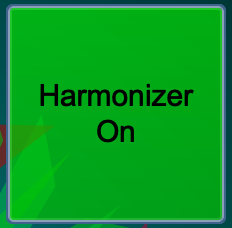
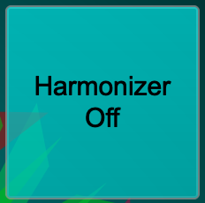
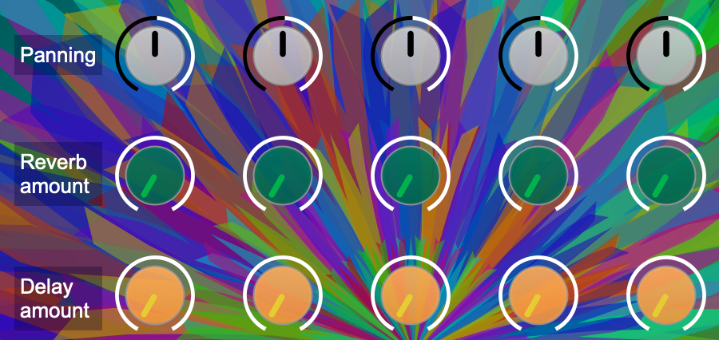
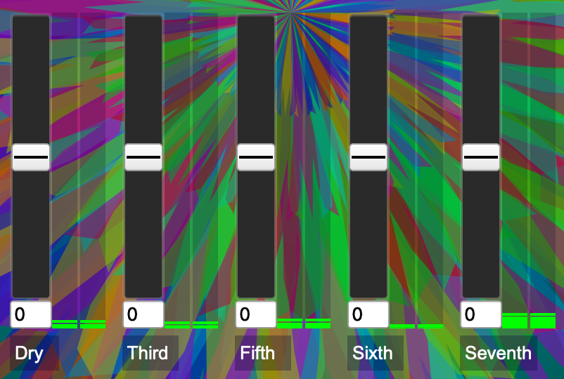
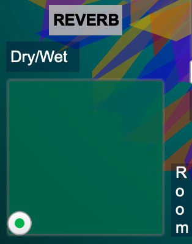
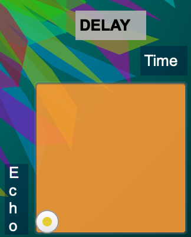

Welcome to the "Harmonizor" by Nonlinear Quasistatic Quintet.

The aim of this project is to mix a dry monophonic signal with an harmonized version of itself.

## INTRODUCTION
When given a signal as input, the harmonizer is capable of producing up to four different voices in real time: 3rds, 5ths, 6ths and 7ths.  
The voices are tuned to the selected scale and mode which can be set from two separate drop-down menus.

Each voice can be mixed by setting four different parameters independently of each voice:
- Volume level (controlled by a slider)
- Panning (left/right output balance)
- Reverb amount
- Delay amount

The parameters for the delay and reverb effects can be set from two indipendent bidimensional sliders.   
All the voices go thorugh the same reverb and delay effect.

To work as intended the PitchShiftPA pseudo-UGen should be installed.  
To install it do as follows:  
1. In the "Language" drop-down menu select "Quarks"
2. From the list find "PitchShiftPA" and click on th "+" button on the left
3. Verify that PitchshiftPA is now on top of the list
4. Click on the "Recompile class library" on the top right of the screen

## INSTRUCTIONS

1. Key and mode can be chosen from these menus. Note that when changing scale, the mode automatically resets to "Ionian" mode.  

2. The "Harmonizer off/on" button toggles between running and paused.  

3. The three rows of knobs control respectively: panning, reverb amount and delay amount.  

4. Each slider controls the volume of each voice, after the delay and reverb. When set all the way down the voice is not heard.  

5. The bidimensional sliders control dry/wet ratio on the x axis and room size on the y axis for the reverb, while the delay has delay time on the x axis and echoes amount on the y axis.  

### NOTES

The program has been tested on Windows 10, 11 and MacOs.  
Slight differences in the gui have been noticed like labels sometimes cutting their written content but the core funtionalities have been consistently well functioning.
